# Student Mentor AI Service

A Python Flask microservice that provides AI-powered student wellbeing analysis and personalized guidance generation.

## Architecture

```mermaid
graph TD
    subgraph "Presentation Layer"
        C["🖥️ Client/Browser"]
    end
    
    subgraph "Student Mentor AI Service"
        F["📦 Flask Application<br/>Student-Mentor AI Service"]
        
        subgraph "Async Processing"
            T1["🧠 Wellbeing Calculation<br/>(Async Task 1)"]
            T2["💡 Guidance Generation<br/>(Async Task 2)"]
        end
    end
    
    subgraph "Backend System"
        S["🚀 Spring Boot<br/>Backend Service"]
        DB[("🗄️ Database")]
        S --> DB
    end
    
    C -->|"1. GET /student-mentor/{id}"| F
    F -->|"2. Request student data"| S
    S -->|"3. Return student data"| F
    F -.->|"4. 202 Accepted (Processing)"| C
    
    F -->|"5. Spawn async tasks"| T1
    F -->|"5. Spawn async tasks"| T2
    
    T1 -->|"6. POST /wellbeing"| S
    T2 -->|"7. POST /guidance"| S

    style T1 stroke-dasharray: 5 5
    style T2 stroke-dasharray: 5 5
    style F stroke-width: 3px
    style S stroke-width: 3px

    classDef client fill:#e1f5fe,stroke:#0288d1,stroke-width:2px
    classDef service fill:#fff3e0,stroke:#f57c00,stroke-width:2px
    classDef backend fill:#f3e5f5,stroke:#7b1fa2,stroke-width:2px
    classDef async fill:#e8f5e9,stroke:#388e3c,stroke-width:2px
    classDef db fill:#ffecb3,stroke:#ffa000,stroke-width:2px
    
    class C client
    class F,T1,T2 service
    class S backend
    class T1,T2 async
    class DB db
```



## How It Works

1. Client calls `GET /student-mentor/{studentId}` on this Flask service
2. Flask fetches student data from Spring Boot backend (`GET /student/info/{studentId}`)
3. Flask immediately returns `202 Accepted` to the client (processing happens in background)
4. Two background tasks run in parallel:
   - **Task 1**: Calculate stress percentage + generate wellbeing gist → Submit to `POST /wellbeing/{studentId}`
   - **Task 2**: Generate personalized guidances → Submit to `POST /guidance/{studentId}`

## Installation

```bash
pip install -r requirements.txt
```

## Configuration

| Variable | Default | Description |
|----------|---------|-------------|
| `API_BASE_URL` | `http://localhost:8080` | Spring Boot backend URL |
| `ADMIN_PASSWORD` | (empty) | **Required** - Password for admin login to get JWT token |
| `DEEPSEEK_API_KEY` | (empty) | Deepseek API key for AI features |
| `DEEPSEEK_API_URL` | `https://api.deepseek.com/v1/chat/completions` | Deepseek API endpoint |
| `PORT` | `5000` | Flask server port |
| `FLASK_DEBUG` | `False` | Enable debug mode |

```bash
# Windows PowerShell
$env:API_BASE_URL="http://localhost:8080"
$env:ADMIN_PASSWORD="your-admin-password"
$env:DEEPSEEK_API_KEY="your-api-key"  # Optional

# Linux/Mac
export API_BASE_URL=http://localhost:8080
export ADMIN_PASSWORD=your-admin-password
export DEEPSEEK_API_KEY=your-api-key  # Optional
```

### Authentication

The service authenticates with the Spring Boot backend using JWT:

1. On first API call, the service calls `POST /auth/login` with:
   ```json
   {
     "username": "admin",
     "password": "<ADMIN_PASSWORD>"
   }
   ```
2. The JWT token is cached and reused for subsequent requests
3. If a request returns 401/403, the token is refreshed automatically

## Running

```bash
python app.py
```

Server starts at `http://localhost:5000`

---

## API Endpoints

### GET /student-mentor/{studentId}

Main entry point. Triggers background AI processing for the student.

**Request:**
```
GET /student-mentor/123
```

**Success Response (202 Accepted):**
```
(empty body - processing happens asynchronously)
```

**Error Response (404):**
```json
{
  "error": "Student not found"
}
```

**Error Response (400):**
```json
{
  "error": "Invalid student ID"
}
```

**Error Response (500):**
```json
{
  "error": "Connection error: ..."
}
```

---

### GET /health

Health check endpoint.

**Request:**
```
GET /health
```

**Response (200):**
```json
{
  "status": "healthy",
  "api_base_url": "http://localhost:8080",
  "deepseek_configured": true
}
```

---

## Background Processing

### Data Fetched from Spring Boot

`GET /student/info/{studentId}` returns:

```json
{
  "studentId": 123,
  "habitsSummary": {
    "studentId": 123,
    "startDate": "2024-11-24",
    "endDate": "2024-12-24",
    "averageSleepQuality": 7.5,
    "averageSleepHours": 8.2,
    "averageBedtime": 22.5,
    "averageWakeTime": 6.7,
    "averageWaterIntake": 2.5,
    "averageJunkFoodFrequency": 2.0,
    "averageMealsConsumed": 3.0,
    "averageExerciseHours": 1.5,
    "totalCaloriesBurned": 5000,
    "mostCommonExerciseType": "Running",
    "averageScreenTimeHours": 4.5,
    "averagePreSleepScreenTime": 1.0,
    "averageMediaDuration": 2.0,
    "educationalContentCount": 15,
    "mostUsedPlatform": "YouTube"
  },
  "physicalProfile": {
    "id": 1,
    "studentId": 123,
    "textToSpeechNeeded": false,
    "motorSupportNeeded": false,
    "bodyWeightKg": 70.5,
    "heightFeet": 6,
    "heightInches": 2,
    "medicalCondition": null,
    "medicalConditionNotes": null,
    "createdAt": "2024-01-01T10:00:00",
    "updatedAt": "2024-12-24T10:00:00"
  },
  "interests": {
    "studentId": 123,
    "hobbies": ["READING", "CODING", "MUSIC"],
    "professions": ["SOFTWARE_ENGINEER", "DATA_SCIENTIST"],
    "accolades": ["Science Fair Winner", "Math Olympiad"]
  },
  "iqScore": 120.5,
  "eqScore": 115.0,
  "oceanScore": {
    "id": 1,
    "imagination": 75.5,
    "artisticInterests": 68.2,
    "emotionality": 72.0,
    "adventurousness": 65.5,
    "intellect": 80.0,
    "liberalism": 70.5,
    "selfEfficacy": 78.0,
    "orderliness": 72.5,
    "dutifulness": 75.0,
    "achievementStriving": 82.5,
    "selfDiscipline": 70.0,
    "cautiousness": 68.5,
    "friendliness": 75.5,
    "gregariousness": 70.0,
    "assertiveness": 72.5,
    "activityLevel": 75.0,
    "excitementSeeking": 68.0,
    "cheerfulness": 80.5,
    "trust": 72.0,
    "morality": 78.5,
    "altruism": 75.0,
    "cooperation": 77.5,
    "modesty": 70.0,
    "sympathy": 73.5,
    "anxiety": 45.0,
    "anger": 40.0,
    "depression": 42.5,
    "selfConsciousness": 48.0,
    "immoderation": 50.0,
    "vulnerability": 46.5,
    "createdAt": "2024-01-01T10:00:00",
    "updatedAt": "2024-12-24T10:00:00"
  },
  "unresolvedComplaints": [
    {
      "id": 1,
      "description": "Difficulty with group project coordination",
      "accusedStudentIds": [456],
      "anonymous": false,
      "trackingCode": "TRACK123",
      "status": "SUBMITTED",
      "submitterId": 123,
      "assignedStaffId": 10,
      "createdAt": "2024-12-20T10:30:00"
    }
  ],
  "currentWeekPulse": {
    "id": 1,
    "rating": 4,
    "weekStartDate": "2024-12-23",
    "createdAt": "2024-12-23T09:00:00"
  }
}
```

---

### Task 1: Wellbeing Calculation

**Input Data Used:**
- `habitsSummary` - Sleep, diet, exercise, screen time, media habits
- `unresolvedComplaints` - Active complaints
- `currentWeekPulse` - Weekly mood rating

**Calculates:**
- `stressPercentage` (0-100)
- `stressColour` (GREEN/YELLOW/ORANGE/RED)
- `wellbeingGist` (AI-generated paragraph)

**Submits to Spring Boot:**
```
POST /wellbeing/{studentId}
Content-Type: application/json

{
  "stressPercentage": 45,
  "stressColour": "YELLOW",
  "wellbeingGist": "Based on your recent habits, you're maintaining a balanced routine with good sleep patterns averaging 8 hours per night. Your exercise consistency is commendable. There's one active complaint being addressed, but overall your weekly pulse shows a positive outlook. Keep focusing on reducing pre-sleep screen time for even better rest."
}
```

---

### Task 2: Guidance Generation

**Input Data Used:**
- `physicalProfile` - Height, weight, medical conditions, accessibility needs
- `interests` - Hobbies, professions, accolades
- `iqScore` - IQ test score
- `eqScore` - EQ test score
- `oceanScore` - Big5 personality traits

**Generates:** 2-3 personalized daily guidances

**Submits to Spring Boot:**
```
POST /guidance/{studentId}
Content-Type: application/json

{
  "guidances": [
    "Start your morning with 10 minutes of coding challenges to engage your analytical mind",
    "Take a 20-minute walk while listening to music to combine your interests with physical activity",
    "Practice deep breathing for 5 minutes before bed to improve sleep quality"
  ],
  "date": "2024-12-24"
}
```

---

## Stress Calculation Details

### Total Score: 0-90

| Component | Range | Source |
|-----------|-------|--------|
| Habits Score | 0-30 | `habitsSummary` |
| Complaints Score | 0-30 | `unresolvedComplaints` |
| Pulse Score | 6-30 | `currentWeekPulse` |

### Habits Score (0-30)

15 metrics, each scored 0-2:

| Category | Metrics |
|----------|---------|
| Sleep (4) | Quality, hours, bedtime, wake time |
| Diet (3) | Water intake, junk food frequency, meals consumed |
| Exercise (3) | Hours, calories burned, exercise type |
| Screen Time (2) | Daily hours, pre-sleep hours |
| Media (3) | Duration, educational content count, platform type |

### Complaints Score (0-30)

- **With Deepseek API:** AI analyzes complaint descriptions and returns severity score
- **Without API:** 5 points per complaint (max 30)

### Pulse Score (6-30)

Inverted rating (higher rating = lower stress):
- Rating 5 (best mood) → Score 6 (low stress)
- Rating 1 (worst mood) → Score 30 (high stress)

### Stress Color Thresholds

| Score | Percentage | Color |
|-------|------------|-------|
| 0-30 | 0-33% | GREEN |
| 31-60 | 34-67% | YELLOW |
| 61-75 | 68-83% | ORANGE |
| 76-90 | 84-100% | RED |

---

## Guidance Generation Details

AI considers the following to create personalized habits:

| Data | Usage |
|------|-------|
| Height/Weight | Physical activity recommendations |
| Medical conditions | Safe exercise suggestions |
| Hobbies | Aligned habit recommendations |
| Professions | Career-relevant skills |
| IQ/EQ scores | Learning style adaptation |
| Personality traits | Activity type matching |

---

## Fallback Behavior (Testing Without API Key)

The service works **fully without a Deepseek API key** for end-to-end testing:

| Component | With API Key | Without API Key (Fallback) |
|-----------|--------------|---------------------------|
| **Stress Score** | AI analyzes complaint severity | Heuristic: 5 points per complaint (max 30) |
| **Wellbeing Gist** | AI-generated personalized paragraph | Auto-generated based on habits, complaints, and pulse data |
| **Guidances** | AI-generated personalized habits | Semi-personalized based on hobbies, screen time, water intake |

### Fallback Examples

**Wellbeing Gist (no API key):**
> "You're getting a healthy 7.5 hours of sleep on average, which is great for your wellbeing. Your exercise routine of 1.5 hours daily shows good commitment to physical health. It's positive that you don't have any pending concerns at the moment. Your recent mood rating suggests you're feeling good - keep up the positive momentum!"

**Guidances (no API key):**
```json
[
  "Dedicate 30 minutes daily to practice reading to develop your skills and passion",
  "Take a 10-minute break every hour from screens to rest your eyes and stretch",
  "Drink at least 8 glasses of water throughout the day, keeping a water bottle nearby"
]
```

### Other Fallbacks

| Scenario | Fallback |
|----------|----------|
| Missing habits data | Default stress score of 15 (middle range) |
| Missing pulse data | Default stress score of 18 (middle range) |
| Background task failure | Logged to console, main response unaffected |

---

## Dependencies

```
Flask==3.0.0
flask-cors==4.0.0
requests==2.31.0
```

---

## Local Testing

### Prerequisites

1. Python 3.8+ installed
2. Spring Boot backend running on `http://localhost:8080` (or configure `API_BASE_URL`)
3. (Optional) Deepseek API key for AI features

### Step 1: Install Dependencies

```bash
pip install -r requirements.txt
```

### Step 2: Start the Flask Service

```bash
# Without API key (uses fallback responses - perfect for testing)
python app.py

# Or with debug mode enabled
$env:FLASK_DEBUG="True"  # Windows PowerShell
python app.py
```

The service starts at `http://localhost:5000`

### Step 3: Verify Health

```bash
curl http://localhost:5000/health
```

Expected response:
```json
{
  "status": "healthy",
  "api_base_url": "http://localhost:8080",
  "auth_configured": true,
  "deepseek_configured": false
}
```

### Step 4: Trigger Processing

```bash
curl http://localhost:5000/student-mentor/123
```

Expected response: `202 Accepted` (empty body)

### Step 5: Check Console Logs

You should see async processing logs:

```
[Async] Starting wellbeing calculation for student 123
[Async] Starting guidance generation for student 123
[Async] Successfully saved wellbeing data for student 123
[Async] Successfully saved guidances for student 123
```

### Step 6: Verify Data in Spring Boot

Check that the data was persisted:

```bash
# Check wellbeing data
curl http://localhost:8080/wellbeing/123

# Check guidance data  
curl http://localhost:8080/guidance/123
```

### Testing Without Spring Boot Backend

If you don't have the Spring Boot backend running, you'll see error logs:

```
[Async] Error processing wellbeing for student 123: Connection error...
```

To test the Flask service in isolation, you can use a mock server or simply verify the health endpoint works.

### Testing Different Scenarios

| Test Case | How to Test |
|-----------|-------------|
| Valid student | `curl http://localhost:5000/student-mentor/123` |
| Invalid student ID | `curl http://localhost:5000/student-mentor/abc` (returns 404) |
| Health check | `curl http://localhost:5000/health` |
| With debug logs | Set `FLASK_DEBUG=True` before running |

### Sample Test Script (Windows PowerShell)

```powershell
# Set required environment variable
$env:ADMIN_PASSWORD="your-admin-password"

# Start the service (in a separate terminal)
python app.py

# Test health endpoint
Invoke-RestMethod -Uri "http://localhost:5000/health" -Method Get

# Trigger student processing
Invoke-RestMethod -Uri "http://localhost:5000/student-mentor/123" -Method Get

# Wait for async processing
Start-Sleep -Seconds 3

# Check Spring Boot for results (if running)
Invoke-RestMethod -Uri "http://localhost:8080/wellbeing/123" -Method Get
Invoke-RestMethod -Uri "http://localhost:8080/guidance/123" -Method Get
```

### Sample Test Script (Linux/Mac)

```bash
# Set required environment variable
export ADMIN_PASSWORD=your-admin-password

# Start the service (in a separate terminal)
python app.py

# Test health endpoint
curl http://localhost:5000/health

# Trigger student processing
curl -i http://localhost:5000/student-mentor/123

# Wait for async processing
sleep 3

# Check Spring Boot for results (if running)
curl http://localhost:8080/wellbeing/123
curl http://localhost:8080/guidance/123
```

---

## Production Deployment

```bash
pip install gunicorn
gunicorn -w 4 -b 0.0.0.0:5000 app:app
```
